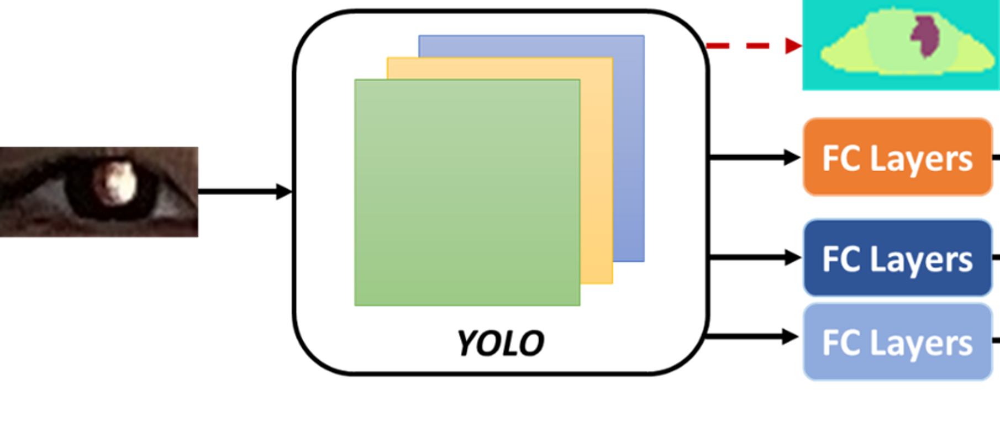
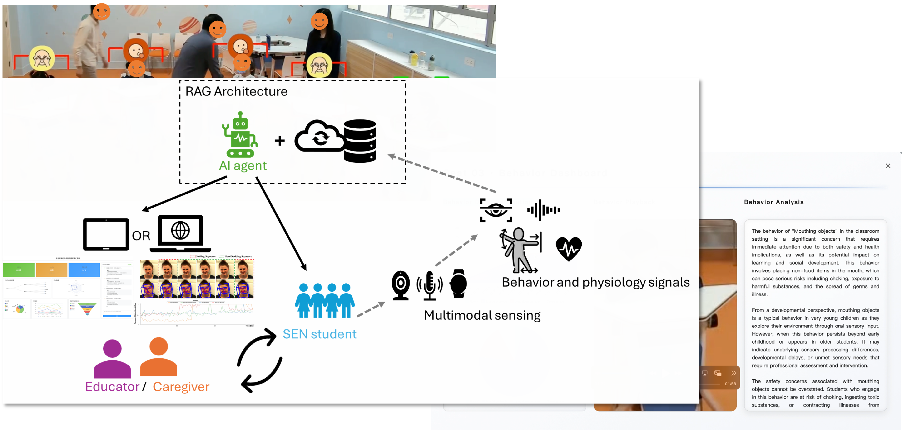
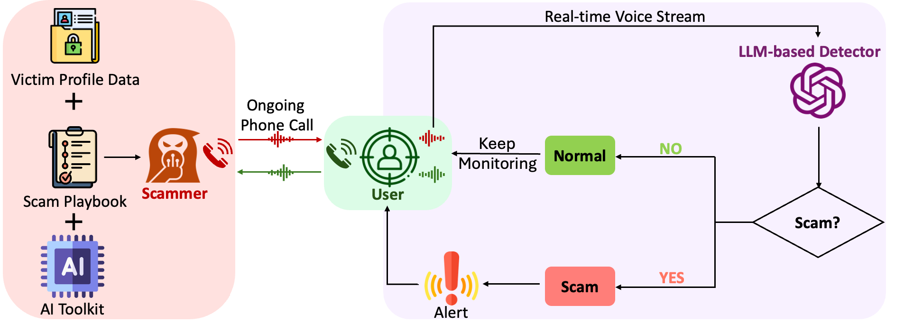
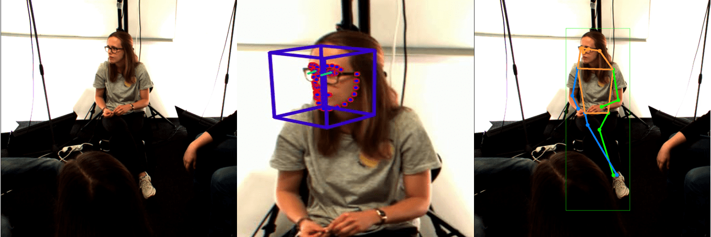
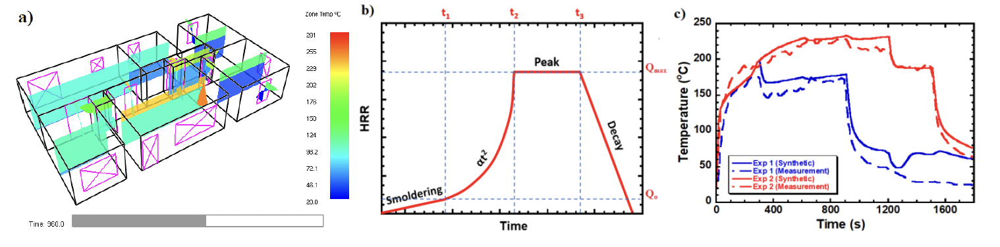
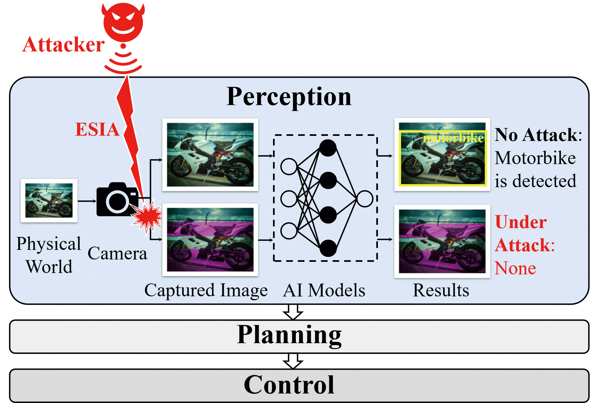

# Dr. Eugene Yujun FU (符欲均)

**Assistant Professor**  
Centre for Learning, Teaching and Technology (LTTC) &  
Department of Mathematics and Information Technology (MIT)  
The Education University of Hong Kong (EdUHK)  

**Email:** [eugenefu@eduhk.hk](mailto:eugenefu@eduhk.hk)  
**Phone:** (+852) 2948 7936  
**Address:** B4-2/F-24, The Education University of Hong Kong  

[Google Scholar](https://scholar.google.com/citations?user=dipVCTIAAAAJ&hl=en) | [ResearchGate](https://www.researchgate.net/profile/Eugene-Fu) | [GitHub](https://github.com/AffectiveComputingLab-HK) | [ORCID](https://orcid.org/0000-0003-1048-1904)

---

## Biography

Dr. Eugene Yujun Fu is an Assistant Professor at The Education University of Hong Kong (EdUHK). Prior to joining EdUHK, he served as a Research Assistant Professor and Postdoctoral Fellow at The Hong Kong Polytechnic University (PolyU). He earned his Ph.D. in Computing from PolyU, his M.Sc. in Electronic Engineering from City University of Hong Kong, and his B.Eng. in Computer Science and Technology from Zhejiang University.

Eugene's research is inherently interdisciplinary, focusing on **Human-Centric Artificial Intelligence (AI)**. He applies machine learning, multimedia computing, and signal processing to understand human behavior and solve real-world problems. His work spans diverse fields, including affective computing, educational data mining, AI security, digital healthcare, and smart firefighting. He actively collaborates with experts across various domains to develop practical, AI-driven solutions that enhance human health, safety, and learning experiences.

---

## Research Interests

* **Human-Centered AI & Affective Computing**
* **AI in Education & Educational Data Mining**
* **Reliable AI & Security**
* **Multimedia Computing & Smart Engineering**

---

## Featured Research

<!-- 提示用户可以左右滑动的小字 -->

  👉 Swipe / Scroll horizontally to see more

<!-- 隐藏滚动条的样式 -->

<!-- 滚动容器 -->

  
   <!-- Highlight 1: ITF Refractive Error -->
  

    
    <h4>Smartphone-based Refractive Error Detection</h4>
    
Developing robust machine learning models for detecting refractive errors using smartphone videos. Supported by the ITF-ITSP Seed Project ($999,925).

  

  
  <!-- Highlight 2: STARS for SEN Students -->
  

    
    <h4>STARS: Multimodal AI for SEN Students</h4>
    
Research and development on multimodal AI-driven educational support systems for Special Educational Needs (SEN) students. Supported by EdUHK KTF.

  

  <!-- Highlight 3: LLM Scam Detection -->
  

    
    <h4>Real-time Phone Scam Detection</h4>
    
Exploring LLM-based and privacy-preserving (MASK) real-time detection of phone scams. Published in top-tier venues including CHI '25 and ACM MM '25.

  

  <!-- Highlight 4: Multimedia Communication Behavior -->
  

    
    <h4>Nonverbal Communication & Engagement</h4>
    
Modeling individual differences in nonverbal cues for enhanced backchannel and engagement detection. Several awards and publications at the ACM MM Grand Challenge.

  

  <!-- Highlight 5: Smart Firefighting -->
  

    
    <h4>AI for Smart Firefighting</h4>
    
Predicting real-time flashover occurrences in multi-compartment buildings using explainable machine learning and spatial-temporal graph neural networks.

  

  <!-- Highlight 6: Electromagnetic Signal Injection Attacks -->
  

    
    <h4>Electromagnetic Signal Injection Attacks</h4>
    
Understanding, modeling, and mitiaging the impacts of Electromagnetic Signal Injection Attacks (ESIA) on intelligent image sensing.

  

---

## Selected Publications & Projects by Direction

### 1. Human-Centered AI & Affective Computing
*Focusing on mental/physical health monitoring, emotion recognition, and ubiquitous sensing.*

**Selected Publications:**

* **[Neurocomputing '25]** TMAN: A temporal multimodal attention network for backchannel detection. *Neurocomputing*. [Paper](https://doi.org/10.1016/j.neucom.2025.131605) [Code](https://github.com/AffectiveComputingLab-HK/TMAN_Backchannel)
* **[IJMI '25]** Refractive error detection in smartphone images via convolutional neural network. *International Journal of Medical Informatics*. [Paper](https://doi.org/10.1016/j.ijmedinf.2025.106083)
* **[EAAI '23]** Is your mouse attracted by your eyes: Non-intrusive stress detection in off-the-shelf desktop environments. *Engineering Applications of Artificial Intelligence*. [Paper](https://doi.org/10.1016/j.engappai.2023.106495)
* **[ACM MM '23]** MultiMediate 2023: Engagement Level Detection using Audio and Video Features. *ACM International Conference on Multimedia* [Paper](https://doi.org/10.1145/3581783.3612873)
* **[ACM MM '23]** Unveiling Subtle Cues: Backchannel Detection Using Temporal Multimodal Attention Networks. *ACM International Conference on Multimedia*. [Paper](https://doi.org/10.1145/3581783.3612870)

**Selected Projects:**

* Research and Development of Robust Refractive Error Detection Utilizing Machine Learning Models and Smartphone Videos (2025) — *Co-PI*, **ITF-ITSP Seed Project**, **$999,925**.
* Modeling Individual Differences in Nonverbal Communication Cues: A Machine Learning Framework for Enhanced Backchannel and Engagement Detection (2025) — *PI*, Start-up Research Grant EdUHK, **$300,000**.
* Tomorrow Digital Healthcare in Metaverse: Developing AI-Powered Personalized Remote Health Monitoring and Therapy Platform (2024) — *PI*, PolyU, **$1,483,694**.
* Towards Digital Mental Health Care for College Students: Developing Machine Learning Models for In-Situ Stress Detection via Multimodal Signals (2022) — *PI*, Start-up Research Grant PolyU, **$250,000**.

### 2. AI in Education & Educational Data Mining
*Focusing on learning analytics, student engagement, and AI-driven educational support.*

**Selected Publications:**

* **[BESC '25]** Using Topic Detection to Analyze Student Reflections in Service-Learning: A Text Mining Method for Understanding Learning Gains. *International Conference on Behavioural and Social Computing*. (Best Paper Award) [Paper](https://doi.org/10.1007/978-981-95-7138-3_27)
* **[BESC '25]** Multimodal Learning Analytics for Predicting Learning Gains in Online Service-Learning Programs. *International Conference on Behavioural and Social Computing*. [Paper](https://doi.org/10.1007/978-981-95-7138-3_32)
* **[BESC '25]** Student Learning Engagement Recognition Method Based on Video Transformer. *International Conference on Behavioural and Social Computing*. [Paper](https://doi.org/10.1007/978-981-95-7138-3_18)
* **[KBS '25]** Personalized e-learning resource recommendation using multimodal-enhanced collaborative filtering. *Knowledge-Based Systems*. [Paper](https://doi.org/10.1016/j.knosys.2025.113605)
* **[EAIT '23]** Using attention-based neural networks for predicting student learning outcomes in service-learning. *Education and Information Technologies*. [Paper](https://doi.org/10.1007/s10639-023-11592-0)

**Selected Projects:**

* Special Teaching Assistant with Responsive Sensing (STARS): Research and Development on Multimodal AI-Driven Educational Support Systems for SEN Students (2025) — *PI*, Knowledge Transfer Fund EdUHK, **$400,000**.

### 3. Reliable AI & Security
*Focusing on the safety of cyber-physical systems, LLM security, and scam detection.*

**Selected Publications:**

* **[ACM MM '25]** One Size Fits All? A Modular Adaptive Sanitization Kit (MASK) for Customizable Privacy-Preserving Phone Scam Detection. *ACM International Conference on Multimedia*. [Paper](https://doi.org/10.1145/3746027.3758164)
* **[AAAI '25]** Is Your Autonomous Vehicle Safe? Understanding the Threat of Electromagnetic Signal Injection Attacks on Traffic Scene Perception. *AAAI Conference on Artificial Intelligence*. [Paper](https://doi.org/10.1609/aaai.v39i26.34958)
* **[AAAI '25]** Combating Phone Scams with LLM-based Detection: Where Do We Stand? (Student Abstract) *AAAI Conference on Artificial Intelligence*. [Paper](https://doi.org/10.1609/aaai.v39i28.35298)
* **[CHI '25]** "It Warned Me Just at the Right Moment": Exploring LLM-based Real-time Detection of Phone Scams. *CHI Conference on Human Factors in Computing Systems*. [Paper](https://doi.org/10.1145/3746027.3758164)
* **[ICME'24]** Understanding Impacts of Electromagnetic Signal Injection Attacks on Object Detection. *IEEE International Conference on Multimedia and Expo.* [Paper](https://doi.org/10.1109/ICME57554.2024.10688003)

### 4. Smart City & Engineering Applications (Smart Firefighting)
*Focusing on applying machine learning to hazard prediction and smart environments.*

**Selected Publications:**

* **[Intelligent Building Fire Safety and Smart Firefighting '24]** Introduction of Artificial Intelligence. *Intelligent Building Fire Safety and Smart Firefighting* [Paper](https://doi.org/10.1007/978-3-031-48161-1_4)
* **[ESWA '23]** Real-time flashover prediction model for multi-compartment building structures using attention based recurrent neural networks. *Expert Systems with Applications*. [Paper](https://doi.org/10.1016/j.eswa.2023.119899)
* **[Fire Safety Journal '23]** An explainable machine learning based flashover prediction model using dimension-wise class activation map. *Fire Safety Journal*. [Paper](https://doi.org/10.1016/j.firesaf.2023.103849)
* **[EAAI '22]** A spatial temporal graph neural network model for predicting flashover in arbitrary building floorplans. *Engineering Applications of Artificial Intelligence*. [Paper](https://doi.org/10.1016/j.engappai.2022.105258)
* **[AAAI '21]** Predicting Flashover Occurrence using Surrogate Temperature Data. *AAAI Conference on Artificial Intelligence*. [Paper](https://doi.org/10.1609/aaai.v35i17.17736)

---

## Honors & Awards

* **Best Paper Award**, BESC (2025)
* **Silver Medal**, International Exhibition of Inventions Geneva (2025 & 2023)
* **1st Place**, Backchannel Detection Challenge, Grand Challenge at ACM MM (2023)
* **2nd Place**, Engagement Estimation Challenge, Grand Challenge at ACM MM (2023)
* **1st Place**, Eye Contact Detection Challenge, Grand Challenge at ACM MM (2021)
* **Best Student Paper Award**, ACM MoMM (2016)

---
*Last updated: April 2026*
